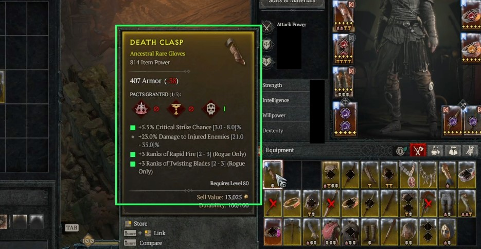

# 

Filter items and sigils in your inventory based on affixes, aspects and thresholds of their values. For questions,
feature request or issue reports join the [discord](https://discord.gg/YyzaPhAN6T) or use github issues.

]

## Features

- Filter items in inventory and stash
- Filter by item type, item power and greater affix count
- Filter by affix and their values
- Filter uniques by their affix and aspect values
- Filter sigils by blacklisting and whitelisting locations and affixes
- Quickly move items from your stash or inventory
- Supported resolutions are all aspect ratios between 16:10 and 21:9

## How to Setup

### Game Settings

- Font size can be small or medium in the Gameplay Settings
- Game Language must be English
- The tool does not play well with HDR as it makes everything super bright
- The advanced item comparison feature might cause incorrect classifications
- Stuttering has been reported on some machines with V-Sync, G-Sync, Active Sync or similar enabled in the settings.

### Quick start guide

- Download and extract the latest version (.zip) from the releases: https://github.com/aeon0/d4lf/releases
- Generate a profile of what you want to filter for. To do so you have a few options:
    - Open gui.bat and import a profile by pasting a build page from popular planner websites
    - Take one someone else has generated from our [discord](https://discord.gg/YyzaPhAN6T)
    - Create one yourself by looking at the [examples](#how-to-filter--profiles) below
- If downloaded or created manually, place the profile in the `C:/Users/<WINDOWS_USER>/.d4lf/profiles` folder. The GUI
  importer has a button to open this folder directly. If imported they are placed there automatically.
- Run gui.bat and use the GUI config tab to configure the profiles. Select the '...' next to profiles to activate which
  profiles you want to use.
- Execute d4lf.exe and launch Diablo 4.
- There is a small overlay on the center bottom with buttons:
    - max/min: Show or hide the console output
    - filter: Auto filter inventory and stash if open (number of stash tabs configurable)
    - vision: Turn vision mode (overlay) on/off
- Alternatively use the hotkeys. e.g. f11 for filtering

### Common problems

- The GUI crashes immediately upon opening, with no error message given
    - This almost always means there is an issue in your params.ini. Delete the file and then open the GUI and configure
      your params.ini through the config tab. Using the GUI for configuration will ensure the file is always accurate.
- I'm used to my profiles being in the downloaded d4lf folder, where are they?
    - This was never the recommended place to keep the profiles. They should now be placed in your Windows user folder
      so that you don't need to move them around for every update. Use the GUI to open up that folder directly.
- I'm used to affix fields looking like this: `[ dexterity, 33 ]`
    - Formats like `[ dexterity, 33 ]` are still completely valid. The importer creates affix fields which look
      like `{name: dexterity, value: 33}`. These are identical and either format can be used interchangeably. We
      recommend starting all new builds through the importer, so examples show the format the importer uses.
- Mouse control isn't possible
    - Due to your local windows settings, the tool might not be able to control the mouse. Just run the tool as admin
      and it should work. If you don't want to run it as admin, you can disable the mouse control in the params.ini
      by setting `vision_mode_only` to `true`.

### Configs

The config folder in `C:/Users/<WINDOWS_USER>/.d4lf` contains:

- **profiles/\*.yaml**: These files determine what should be filtered. Profiles created by the GUI will be placed here
  automatically.
- **params.ini**: Different hotkey settings and number of chest stashes that should be looked at. Management of this
  file should be done through the GUI.

### params.ini

| [general]                                         | Description                                                                                                                                                                                                                                                                          |
|---------------------------------------------------|--------------------------------------------------------------------------------------------------------------------------------------------------------------------------------------------------------------------------------------------------------------------------------------|
| profiles                                          | A set of profiles separated by comma. d4lf will look for these yaml files in config/profiles and in C:/Users/WINDOWS_USER/.d4lf/profiles                                                                                                                                             |
| keep_aspects                                      | - `all`: Keep all legendary items <br>- `upgrade`: Keep all legendary items that upgrade your codex of power <br>- `none`: Keep no legendary items based on aspect (they are still filtered!)                                                                                        |
| handle_rares                                      | - `filter`: Filter them based on your profiles <br>- `ignore`: Ignores all rares, vision mode shows them as blue and auto mode never junks or favorites them <br>- `junk`: Vision mode shows them always as red, auto mode always junks rares                                        |
| run_vision_mode_on_startup                        | If the vision mode should automatically start when starting d4lf. Otherwise has to be started manually with the vision button or the hotkey                                                                                                                                          |
| check_chest_tabs                                  | Which chest tabs will be checked and filtered for items in case chest is open when starting the filter. You need to buy all slots. Counting is done left to right. E.g. 1,2,4 will check tab 1, tab 2, tab 4                                                                         |
| move_to_inv_item_type<br/>move_to_stash_item_type | Which types of items to move when using fast move functionality. Will only affect tabs defined in check_chest_tabs. <br>- `favorites`: Move favorites only <br>- `junk`: Move junk only <br>- `non_favorites`: Only items not marked as favorite <br>- `everything`: Move everything |
| minimum_overlay_font_size                         | The minimum font size for the vision overlay, specifically the green text that shows which filter(s) are matching. Note: For small profile names, the font may actually be larger than this size but will never go below this size.                                                  |
| hidden_transparency                               | The overlay will become transparent after not hovering it for a while. This can be changed by specifying any value between [0, 1] with 0 being completely invisible and 1 completely visible                                                                                         |
| browser                                           | Which browser to use to get builds, please make sure you pick an installed browser: chrome, edge or firefox are currently supported                                                                                                                                                  |
| full_dump                                         | When using the import build feature, whether to use the full dump (e.g. contains all filter items) or not                                                                                                                                                                            |

| [char]    | Description                       |
|-----------|-----------------------------------|
| inventory | Your hotkey for opening inventory |

| [advanced_options]       | Description                                                                                                              |
|--------------------------|--------------------------------------------------------------------------------------------------------------------------|
| move_to_inv              | Hotkey for moving items from stash to inventory                                                                          |
| move_to_chest            | Hotkey for moving items from inventory to stash                                                                          |
| run_scripts              | Hotkey to start/stop vision mode                                                                                         |
| run_filter               | Hotkey to start/stop filtering items                                                                                     |
| run_filter_force_refresh | Hotkey to start/stop filtering items with a force refresh. All item statuses will be reset                               |
| force_refresh_only       | Hotkey to reset all item statuses without running a filter after                                                         |
| exit_key                 | Hotkey to exit d4lf.exe                                                                                                  |
| log_level                | Logging level. Can be any of [debug, info, warning, error, critical]                                                     |
| scripts                  | Running different scripts                                                                                                |
| process_name             | Process name of the D4 app. Defaults to "Diablo IV.exe". In case of using some remote play this might need to be adapted |
| vision_mode_only         | If set to true, only the vision mode will be available. All functionality that clicks the screen is disabled.            |

### GUI

Documentation is not yet finished. For now, it should be self-explanatory. Just start `gui.bat` in the archive.

Current functionality:

- Import builds from maxroll/d4builds/mobalytics
- Create profiles based off of searches for diablo.trade
- Complete management of your params.ini through the config tab

Each tab gives further instructions on how to use it and what kind of input it expects.

## How to filter / Profiles

All profiles define whitelist filters. If no filter included in your profiles matches the item, it will be discarded.

Your config files will be validated on startup and will prevent the program from starting if the structure or syntax is
incorrect. The error message will provide hints about the specific problem.

The following sections will explain each type of filter that you can specify in your profiles. How you define them in
your YAML files is up to you; you can put all of these into just one file or have a dedicated file for each type of
filter, or even split the same type of filter over multiple files. Ultimately, all profiles specified in
your `params.ini` will be used to determine if an item should be kept. If one of the profiles wants to keep the item, it
will be kept regardless of the other profiles. Similarly, if a filter is missing in all profiles (e.g., there is
no `Sigils` section in any profile), all corresponding items (in this case, sigils) will be kept.

### Affix / Aspects Filter Syntax

You have three choices on how to specify aspects or affixes of an item:

- You can use the shorthand and just specify the aspect name
- For more sophisticated filtering, you can use the following syntax: `[NAME, THRESHOLD, CONDITION]`. The
  condition can be any of `[larger, smaller]` and defaults to `larger` if no value is given.
- Affixes generated through the importer have a different format but function the exact same. An
  example of an imported affix is `{name: dexterity, value: 33, comparison: larger}`. This is completely interchangeable
  with the shorthand notation.

As we recommend using the importer for a base version of your build, even if you intend to then manually create your own
build, the examples below will use the same format as the importer.

<details><summary>Examples</summary>

```yaml

# Filter for attack speed
- { name: attack_speed }
# Filter for attack speed larger than 4
- { name: attack_speed, value: 4 }
# Filter for attack speed smaller than 4
- { name: attack_speed, value: 4, comparison: smaller }

# Below is the older shorthand, which is still valid to use
# Filter for attack speed
- attack_speed
# Filter for attack speed larger than 4
- [ attack_speed, 4 ]
# Filter for attack speed smaller than 4
- [ attack_speed, 4, smaller ]
```

</details>

### Affixes

Affixes are defined by the top-level key `Affixes`. It contains a list of filters that you want to apply. Each filter
has a name and can filter for any combination of the following:

- `itemType`: The name of the type or a list of multiple types.
  See [assets/lang/enUS/item_types.json](assets/lang/enUS/item_types.json)
- `minPower`: Minimum item power
- `minGreaterAffixCount`: Minimum number of greater affixes. Note that this is on the overall item and independent
  of `affixPool`
- `affixPool`: A list of multiple different rulesets to filter for. Each ruleset must be fulfilled or the item is
  discarded
    - `count`: Define a list of affixes (see [syntax](#affix--aspects-filter-syntax)) and
      optionally `minCount`, `maxCount` and `minGreaterAffixCount`
        - `minCount`: specifies the minimum number of affixes that must match the item. defaults to amount of specified
          affixes
        - `maxCount` specifies the maximum number of affixes that must match the item. defaults to amount of specified
          affixes
        - `minGreaterAffixCount`: specifies the minimum number of greater affixes inside this count group. defaults
          to `0`
- `inherentPool`: The same rules as for `affixPool` apply, but this is evaluated against the inherent affixes of the
  item

<details><summary>Config Examples</summary>

```yaml
Affixes:
  # Search for chest armor and pants that are at least item level 725 and have at least 3 affixes of the affixPool
  - NiceArmor:
      itemType: [ chest armor, pants ]
      minPower: 725
      affixPool:
        - count:
            - { name: dexterity, value: 33 }
            - { name: damage_reduction, value: 5 }
            - { name: lucky_hit_chance, value: 3 }
            - { name: total_armor, value: 9 }
            - { name: maximum_life, value: 700 }
          minCount: 3

  # Search for chest armor that is at least item level 925 and have at least 3 affixes of the affixPool. At least 2 of the matched affixes must be greater affixes
  - NiceArmor:
      itemType: chest armor
      minPower: 925
      affixPool:
        - count:
            - { name: dexterity }
            - { name: damage_reduction }
            - { name: lucky_hit_chance }
            - { name: total_armor }
            - { name: maximum_life }
          minCount: 3
          minGreaterAffixCount: 2

  # Search for boots that have at least 2 of the specified affixes and either max evade charges or reduced evade cooldown as inherent affix
  - GreatBoots:
      itemType: boots
      minPower: 800
      inherentPool:
        - count:
            - { name: maximum_evade_charges }
            - { name: attacks_reduce_evades_cooldown_by_seconds }
          minCount: 1
      affixPool:
        - count:
            - { name: movement_speed, value: 16 }
            - { name: cold_resistance }
            - { name: lightning_resistance }
          minCount: 2

  # Search for boots with movement speed and 1 resistances from a pool of shadow, cold, lightning res.
  # No need to add maxCount to the resistance group since it isn't possible for an item to have more than one resistance affix
  - ResBoots:
      itemType: boots
      minPower: 800
      affixPool:
        - count:
            - { name: movement_speed, value: 16 }
        - count:
            - { name: shadow_resistance }
            - { name: cold_resistance }
            - { name: lightning_resistance }
          minCount: 1

  # Search for boots with movement speed. At least two of all item affixes must be a greater affix
  - ResBoots:
      itemType: boots
      minPower: 800
      minGreaterAffixCount: 2
      affixPool:
        - count:
            - { name: movement_speed, value: 16 }
```

</details>

Affix names are lower case and spaces are replaced by underscore. You can find the full list of names
in [assets/lang/enUS/affixes.json](assets/lang/enUS/affixes.json).

### Sigils

Sigils are defined by the top-level key `Sigils`. It contains a list of affix or location names that you want to filter
for. If no Sigil filter is provided, all Sigils will be kept.

<details><summary>Config Examples</summary>

```yaml
Sigils:
  minTier: 40
  maxTier: 100
  blacklist:
    # locations
    - endless_gates
    - vault_of_the_forsaken

    # affixes
    - armor_breakers
    - resistance_breakers
```

If you want to filter for a specific affix or location, you can also use the `whitelist` key. Even if `whitelist` is
present, `blacklist` will be used to discard sigils that match any of the blacklisted affixes or locations.

```yaml
# Only keep sigils for vault_of_the_forsaken without any of the affixes armor_breakers and resistance_breakers
Sigils:
  minTier: 40
  maxTier: 100
  blacklist:
    - armor_breakers
    - resistance_breakers
  whitelist:
    - vault_of_the_forsaken
```

To switch that priority, you can add the `priority` key with the value `whitelist`.

```yaml
# This will keep all vault of the forsaken sigils even if they have armor_breakers or resistance_breakers
Sigils:
  minTier: 40
  maxTier: 100
  blacklist:
    - armor_breakers
    - resistance_breakers
  whitelist:
    - vault_of_the_forsaken
  priority: whitelist
```

You can also create conditional filters based on a single affix or location.

```yaml
# Only keep sigils for iron_hold when it also has shadow_damage
Sigils:
  minTier: 40
  maxTier: 100
  blacklist:
    - armor_breakers
    - resistance_breakers
  whitelist:
    - [ iron_hold, shadow_damage ]
```

</details>

Sigil affixes and location names are lower case and spaces are replaced by underscore. You can find the full list of
names in [assets/lang/enUS/sigils.json](assets/lang/enUS/sigils.json).

### Uniques

Uniques are defined by the top-level key `Uniques`. It contains a list of parameters that you want to filter for. If no
Unique filter is provided, all unique items will be kept.
Uniques can be filtered similar to [Affixes](#Affixes) but due to their nature of fixed
effects, you only have to specify the thresholds that you want to apply.

<details><summary>Config Examples</summary>

```yaml
# Take all uniques with item power > 800
Uniques:
  - minPower: 900
```

```yaml
# Take all unique pants
Uniques:
  - itemType: pants
```

```yaml
# Take all unique chest armors and pants
Uniques:
  - itemType: [ chest armor, pants ]
```

```yaml
# Take all unique chest armors and pants with min item power > 900
Uniques:
  - itemType: [ chest armor, pants ]
    minPower: 900
```

```yaml
# Take all Tibault's Will pants
Uniques:
  - aspect: [ tibaults_will ]
```

```yaml
# Take all Tibault's Will pants with at least 2 greater affixes
Uniques:
  - aspect: [ tibaults_will ]
    minGreaterAffixCount: 2
```

```yaml
# Take all Tibault's Will pants that have item power > 900 and dmg reduction from close > 12 as well as aspect value > 25
Uniques:
  - aspect: [ tibaults_will, 25 ]
    minPower: 900
    affix:
      - { name: damage_reduction_from_close_enemies, value: 12 }
```

</details>

Unique names are lower case and spaces are replaced by underscore. You can find the full list of names
in [assets/lang/enUS/uniques.json](assets/lang/enUS/uniques.json).

## Develop

### Python Setup

- You can use [miniconda](https://docs.conda.io/projects/miniconda/en/latest/) or just plain python.

Conda setup:

```bash
git clone https://github.com/aeon0/d4lf
cd d4lf
conda env create -f environment.yml
conda activate d4lf
python -m src.main
```

Python setup (windows, linux venv activation differs):

```bash
git clone https://github.com/aeon0/d4lf
cd d4lf
python -m venv venv
venv\Scripts\activate
python -m pip install -r requirements.txt
python -m src.main
```

### Formatting & Linting

Ruff is used for linting and auto formatting. You can run it with:

```bash
ruff format
```

```bash
ruff check
```

Setup VS Code by using the ruff extension. Also turn on "trim trailing whitespaces" is VS Code settings.

## Credits

- Icon based of: [CarbotAnimations](https://www.youtube.com/carbotanimations/about)
- Some of the OCR code is originally from [@gleed](https://github.com/aliig). Good guy.
- Names and textures for matching from [Blizzard](https://www.blizzard.com)
